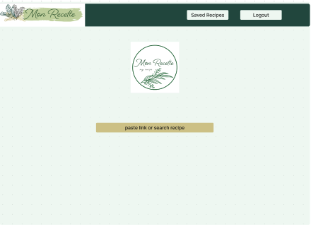
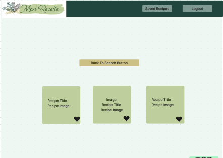
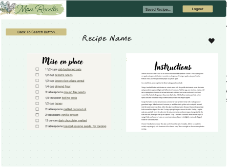

# Mon Recette
  ### 💻 Technologies Used in Backend


## 💡 Project Overview
> This product allows users to save their favorite recipes across multiple websites all in one place.

Grandma used to have a bin full of recipes written on index cards from her favorite books and magazines. That was messy, easy-to-lose, and the cards decayed, especially if you spilt your pasta water on it while following along. The internet changed things, and we can digitally save recipes! However, many websites only save recipes from their website, and don't allow you to import recipes from other locations.

Enter Mon Recette. You can save and edit recipes from multiple websites. Grandma doesn't need to worry about losing or ruining her index cards, and you don't need to worry about having to visit multiple places to find that one recipe you are looking for, but couldn't remember if it belonged to this blog or that blog or allrecipes or foodnetwork, etc.


## Installation

OS X & Linux:
This project runs on Rails 7.0.8.

Fork and clone [this repository](https://github.com/mon-recette/mon-recette-fe), which is the front-end of our application.

Fork and clone [this repository](https://github.com/mon-recette/mon_recette_be) to access our back-end.

Windows:

This product is not compatible with Windows.

## API
This application uses a free and unlimited api called [TheMealDB](https://www.themealdb.com/api.php). You don't need to sign up for a key, or use a key at all!
It also utilizes caching and background workers; caching to make repeated search for terms or recipes quicker (memoization) and workers to handle actions that won't effect the main thread of the application.


## Why Use Mon Recette?

There are plenty of great websites with amazing recipes that will turn any evening into a memory that will last a lifetime. That downside is that those recipes are saved in multiple locations, not in a single place. With Mon Recette, you can import and save recipes from:
1. TheMealDB
2. Food Network
3. All Recipes
4. A Wicked Whisk
5. Taste of Home

We hope to add more complete functionality by incorporating AI to webscrape a more robust collection of websites. Stay tuned!

## What Can This Do?
Mon Recette will save all your recipes in one place. 

### Landing/Log In

Users can create an account using their email.
Once an account has been made, the user will be able to login and see their User Dashboard.

### User dashboard

Functionality here is very simple and straightforward. Either go to your saved recipes list, or search for a food item such as chicken (to find recipes for chicken) or paste in the url from a recipe you found at a different website.

If searching for food terms, it will return a list of recipes with images you can browse.


If pasting a url, it will return that recipe with the ingredients list and instructions side-by-side.


### Saving a recipe
When searching for recipes or pasting a recipe link, there will be a button to save the recipe. It will then show up in your "Saved Recipes" list which can be accessed in the navbar.

### Editing Recipes
Feel like the recipe needs tweaking? We will be adding the ability to edit the recipe soon!

## 🔧 Setup
Download both our [front end](https://github.com/mon-recette/mon-recette-fe) and [back end](https://github.com/mon-recette/mon_recette_be) applications.

Start the server on the back end application by typing the following in the terminal.

```sh
rails s
```

NOTE: The back-end application should be running on PORT 5000,
while the front-end application should be running on PORT 3000.


Run the following code in your terminal to install the gems required to use this application:
```sh
bundle install
```

Check to make sure all the tests are passing by running the following code in your terminal:
```sh
bundle exec rspec
```

## Production Sites
[Frontend](https://monrecette-fe.vercel.app/) is deployed with vercel

[Backend](https://mon-recette-be.herokuapp.com/) is deployed with heroku (note: there is nothing interesting to see here, as be is purely a microservice for frontend).

## Gem Information
We used the Nokogiri gem to webscrape recipe data. 

Click to read more about [Nokogiri](https://nokogiri.org/index.html).

Example of bootstrap code
```    class WebScrapeService 
  def conn(url)
    Faraday.get(url)
  end

  def scrape(url)
    response = conn(url)
    Nokogiri::HTML(response.body)
  end
end
```

### Testing
Our application includes extensive testing using the [Capybara gem](https://github.com/teamcapybara/capybara) to simulate user input and interaction.

This application also uses the [Launchy Gem](https://github.com/copiousfreetime/launchy) to view pages in the browser without needing to start the server.

The [Shoulda Matchers Gem](https://github.com/thoughtbot/shoulda-matchers) is used for one-liner testing of models.

The [Orderly Gem](https://github.com/jmondo/orderly) is used to check the order in which items appear on the pages for our application.

The [SimpleCov Gem](https://github.com/simplecov-ruby/simplecov) provides test coverage analysis for our application. 

The back end handles API calls to the TomTom API as well as accepts post requests from the user for location moods. It simulates API calls using the [WebMock gem](https://github.com/bblimke/webmock) and the [VCR gem](https://github.com/vcr/vcr).

Both use the [Pry gem](https://github.com/pry/pry) and [RSpec Rails](https://github.com/rspec/rspec-rails) within the testing environment for unit and feature testing. 

## Endpoints
1. Search recipes.
Endpoint: `/api/v1/searches`
Description: Fetch recipes using search terms such as "chicken." information.
Example Request:
```
http://127.0.0.1:3000/api/v1/searches?term=chicken
```
Response will be returned in the following JSON contract format:
```
{
    "data": {
        "id": null,
        "type": "meal",
        "attributes": {
            "recipes": [
                {
                    "name": "String",
                    "instructions": "String",
                    "image_url": null,
                    "ingredients": [
                        "String"]
                }]
        }
    }
}
  ```
The same endpoint is used to find recipes from other websites. Here is an example:
```
http://127.0.0.1:5000/api/v1/searches?term=https://www.awickedwhisk.com/homemade-chicken-ravioli-recipe-3/
```
The JSON response will be the same.

2. Save recipes and view them
Endpoint: `/api/v1/recipes`
Description: Fetch user saved recipes.
Example Request:
```
id_params = {
            user_id: user.id
            }

get "/api/v1/recipes", params: id_params

```
Response will be returned in the following JSON contract format:
```
{:data=>
  {:id=>"null",
   :type=>"user_recipes",
   :attributes=>
    {:user_id=> integer,
     :recipes=>[{:name=>"string", :ingredients=>["string", "string"], :instructions=>["string"]}
     ]
    }
  }
}
```
3. Most recent search
Endpoint: `/api/v1/recent_search`
Description: Fetch most recent search term.
Example Request:
```

get "/api/v1/recent_search"

```
Response will be returned in the following JSON contract format:
```
{
    "message": "Most recent search: chicken"
}
```

## Contributors

Sooyung Kim: [GitHub](https://github.com/skim1027) [LinkedIn](https://www.linkedin.com/in/sooyung-kim/)

Allan Evans: [GitHub](https://github.com/aevans27) [LinkedIn](https://www.linkedin.com/in/allan-evans-2c/)

Nathan Trautenberg: [GitHub](https://github.com/WagglyDessert) [LinkedIn](https://www.linkedin.com/in/nathan-trautenberg-9106271a7/)

Amy Siu: [GitHub](https://github.com/amysiu1028) [LinkedIn](https://www.linkedin.com/in/amy-siu-206a71a8/)

Jen Nguyen [GitHub](https://github.com/Jnguyen615) [LinkedIn](https://www.linkedin.com/in/jennifer-nguyen0615/)